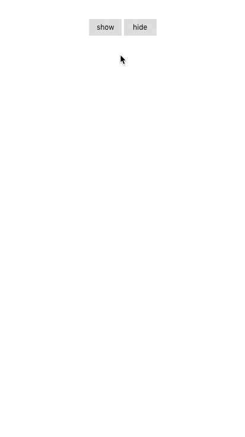

### 简介
一个非常轻量的移动端toast组件

### 预览


### 使用方法
下载toast文件夹，放在vue项目中，然后在入口文件main.js引入、安装，如： 

```
import Vue from 'vue'
import toast from './toast'
Vue.use(toast)
```
可直接传入字符串或数字
```
this.$toast.show('Hello World')
```
也可以这样自定义持续时间
```
this.$toast.show({
    message: 'Hello World',
    duration: 2000
})
```
隐藏toast

```
this.$toast.hide()
```
### 备注
组件使用的是rem单位，因为项目中有做rem适配。可自行在toast.vue中修改样式
### License
[MIT](https://github.com/lawliet467/vue-simple-toast/License)  

Copyright (c) 2019-present lawliet467
